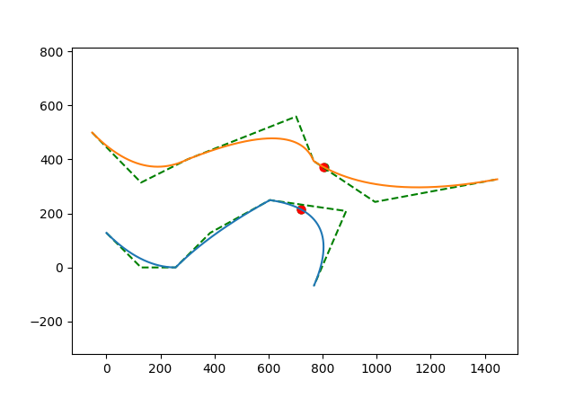
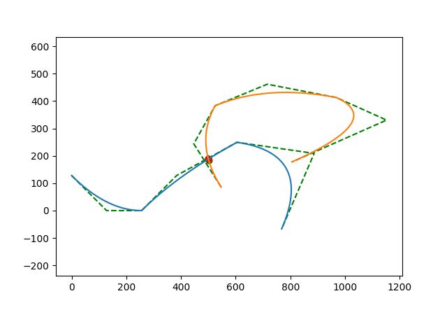
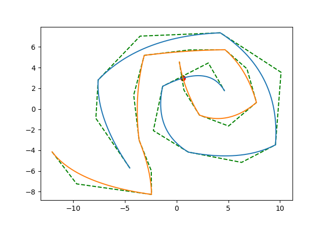
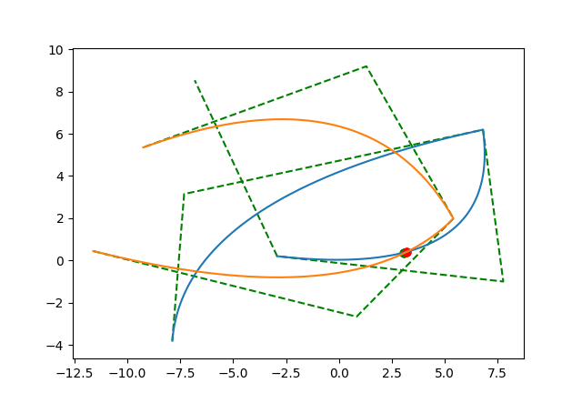
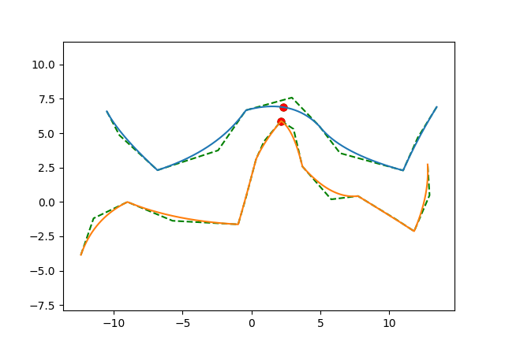
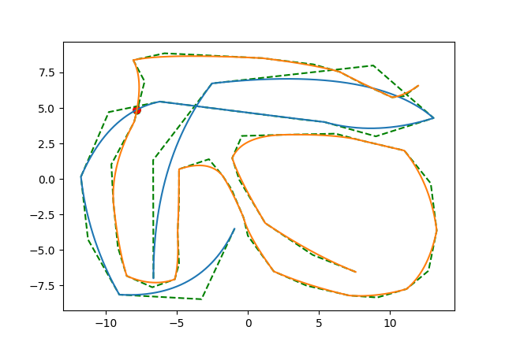

# spline dist

The task is to find the closest points on two splines.

A Bezier curve was taken as a spline

Finding the nearest points is equivalent to finding the minimum distance between two parameterized points on two curves $(x_1(t_1), y_1(t_1))$ и $(x_2(t_2), y_2(t_2))$. Each curve is parameterized by its own parameter. Then we need to minimize by  $(t_1, t_2)$  such a function:

$$
f(t_1, t_2) = (x_1(t_1)-x_2(t_2))^2 + (y_1(t_1)-y_2(t_2))^2
$$

Partial derivatives of which are:

$$
\frac{\partial f}{\partial t_1} = 2(x_1-x_2) \frac{\partial x_1}{\partial t_1} + 2(y_1-y_2) \frac{\partial y_1}{\partial t_1}
$$
And
$$
\frac{\partial f}{\partial t_2} = -2(x_1-x_2) \frac{\partial x_2}{\partial t_2} - 2(y_1-y_2) \frac{\partial y_2}{\partial t_2}
$$

The problem is that the function $f$  may have many local minima. Therefore, the [simulated annealing algorithm](https://en.wikipedia.org/wiki/Simulated_annealing) was chosen to find the global minimum . However, its drawback is that it takes a long time to converge in the local vicinity of the minimum, which reduces accuracy. Therefore, a gradient descent algorithm is used at the end to increase accuracy. The point found by the simulated annealing algorithm becomes the starting point for the gradient descent algorithm.

This solution doesn't find all the minimum points, only the first one. However, if you run the algorithm multiple times in a row, it can find different minimums, depending on the parameters. This solution is suitable for complex cases where exhaustive search is inappropriate, and the running time doesn't depend on the number of support points, only on the parameters.

## How to use

```bash
splines.exe input.txt 2.txt \
    --annealing_iters 100000 \
    --annealing_step 1. \
    --annealing_temperature 1000000 \
    --sgd_learning_rate 1e-1 \
    --sgd_max_iter 10000 \
    --sgd_tolerance 1e-12
```

* `annealing_iters` how many annealing iterations to do, never interrupted
* `annealing_step` annealing step, at what standard deviation from the current point to take a new one, the value 1 corresponds to the length of one section of the spline
* `annealing_temperature` controls how long to search for the global minimum; the longer it is, the greater the probability of searching at another random point. Over time, the temperature decreases, and the algorithm switches to a local search. 
* `sgd_learning_rate` rate of gradient descent
* `sgd_max_iter` - how many gradient descent iterations to perform, it can be interrupted if the required accuracy is reached
* `sgd_tolerance` - premature condition for stopping the descent, controls that the gradient is not too small and there is a point in continuing the descent

The larger `annealing_temperature` and the larger `annealing_iters`, the more accurately the global minimum is found.









